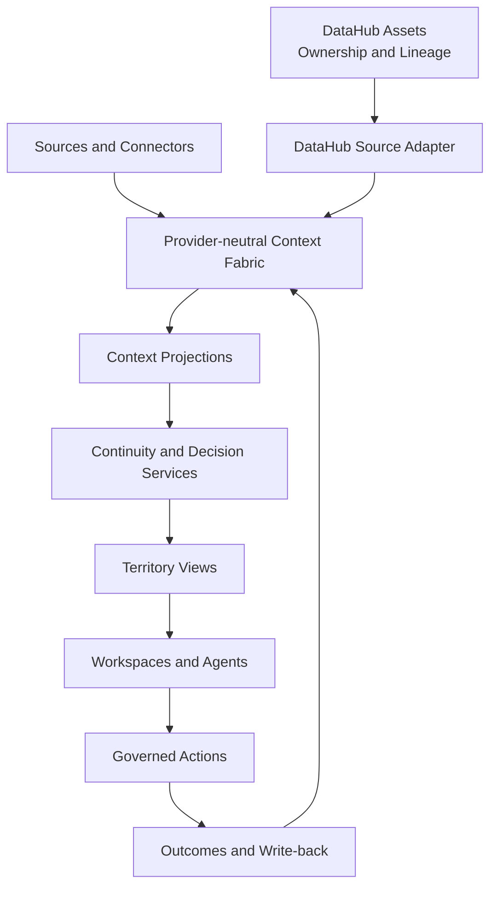

# Nexus Atlas — DataHub Hackathon 2026

> **Archived competition submission.**
>
> This repository preserves the Nexus Atlas build submitted to **Build with DataHub: The Agent Hackathon** in August 2026. It is no longer the canonical development repository.
>
> Long-term Nexus Atlas development continues at [`cyrilla-mist/nexus-ai`](https://github.com/cyrilla-mist/nexus-ai).

**Restore context. Trace decisions. Continue the work.**

Nexus Atlas is personal intelligence infrastructure for maintaining continuity across long-running projects. It restores what changed, which decisions still hold, what evidence became stale, where agents disagree, which governed assets need attention, and what action can safely happen next.

## Submission

- **Status:** submitted competition snapshot
- **Submitted:** August 2026
- **Public demo:** https://cyrilla-mist.github.io/nexus-atlas-datahub-2026/
- **Atlas workspace:** https://cyrilla-mist.github.io/nexus-atlas-datahub-2026/atlas.html
- **Continuity workspace:** https://cyrilla-mist.github.io/nexus-atlas-datahub-2026/reentry.html?source=fixture&scenario=verity
- **Demo video:** https://youtu.be/I5CTEVH4BRc
- **Devpost:** https://devpost.com/software/nexus-atlas-102pc3

This repository is intentionally kept as a reproducible record of the competition build rather than being merged back into the long-term repository history.

## Competition Build

The submission focuses on a **Verity re-entry** scenario. A user returns to a project after an interruption, and Nexus restores a governed continuation route instead of starting from an empty prompt.

The scenario establishes:

```text
4 meaningful changes
4 valid decisions
2 stale evidence records
1 agent conflict
1 missing owner
```

Nexus then connects project continuity with DataHub-governed assets, ownership, lineage, and a confirmation-based repair path.

## Core Experience

```text
Atlas Desk
  → Atlas Map
  → Territory Workspace
  → Context Inspector
  → Governed Action
  → Outcome and Context Write-back
```

### Context Fabric

Nexus organizes project history using provider-neutral primitives such as:

- Project
- Record
- Event
- Decision
- Goal
- Action
- AgentRun
- ExternalAssetRef
- Relationship
- Provenance and State

Rules establish continuity findings before a model interprets them:

```text
Rules establish facts
  → model interprets context
  → user confirms consequential decisions
```

## DataHub Integration

The competition build keeps Nexus and DataHub responsibilities separate:

```text
Nexus Context Fabric
  project history · decisions · memories · goals · actions

DataHub
  governed assets · ownership · lineage · metadata state
```

The Verity scenario defines six governed dataset assets and their lineage. The implementation includes a read-only DataHub path plus an isolated ownership-mutation path with explicit confirmation and read-after-write verification.

A successful mutation response alone is not treated as proof. Nexus closes the repair only after a fresh read confirms the intended owner.

## Architecture



## Repository Structure

```text
atlas/          earlier Project Atlas agent foundation
core/           orchestration foundation
memory/         memory schema and retrieval foundation
execution/      project state and action foundation
experience/     continuity providers and view-model logic
continuity/     deterministic scenarios and schemas
frontend/       Atlas and Continuity interface modules
datahub/        governed assets, readers, bridges, and ingestion
examples/       deterministic sample contracts
tests/          validation and test suites
scripts/        scenario assembly and source verification
docs/           architecture and integration documentation
worker/         Cloudflare Worker prototype
atlas.html      Nexus Atlas shell
reentry.html    Continuity workspace
```

## Reproducible Fixture Demo

Requirements:

- Node.js
- npm
- Python 3

```bash
npm install
npm test
npm run check
npm run verify:verity-continuity
npm run verify:verity-datahub
npm run verify:verity-ingestion
python -m http.server 8000
```

Then open:

```text
http://localhost:8000/atlas.html
http://localhost:8000/reentry.html?scenario=verity#brief
```

The public GitHub Pages build uses deterministic fixture data. Live DataHub, MCP, and governed mutation require the local runtime and are not claimed by the static deployment.

## Documentation

Detailed implementation and architecture material remains preserved in `docs/`, including:

- `docs/Nexus-Atlas-Architecture-Review-v1.0.md`
- `docs/Nexus-DataHub-Verity-Assets.md`
- `docs/nexus-atlas-guide-zh.md`
- `docs/architecture/`

## Historical Scope

This repository reflects the **DataHub Hackathon 2026 submission state**. Future Nexus architecture, product direction, and implementation changes belong in [`cyrilla-mist/nexus-ai`](https://github.com/cyrilla-mist/nexus-ai).

No future capability should be inferred from this snapshot unless it is also present in the canonical repository.

## Privacy

The Verity demonstration uses deterministic synthetic metadata. The repository does not intentionally contain private production data, confidential research data, API keys, access tokens, or service-account credentials.

## License

Copyright 2026 cyrilla-mist.

Licensed under the [Apache License 2.0](LICENSE).
