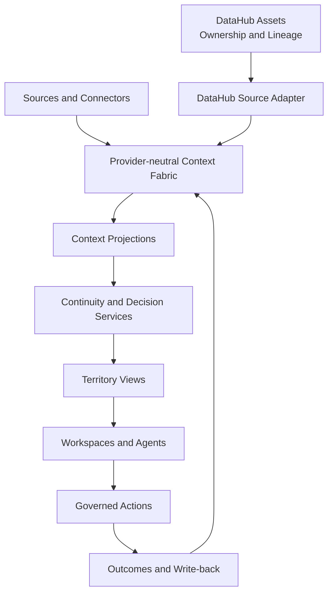

# Nexus Atlas

> **DataHub Hackathon 2026 · Submission Candidate**
>
> This repository is an independent competition build of Nexus Atlas.
> It is not frozen yet and may receive final documentation, evidence,
> and presentation updates before submission.
>
> Long-term Nexus Atlas development continues at:
> https://github.com/cyrilla-mist/nexus-ai

**Restore context. Trace decisions. Continue the work.**

Nexus Atlas is a **personal intelligence infrastructure** for maintaining continuity across long-term projects.

When a project is interrupted, the files usually remain—but the surrounding context becomes difficult to recover. Nexus restores what changed, which decisions are still valid, what evidence is outdated, where agents disagree, which governed assets are incomplete, and what action should happen next.

Nexus is not a generic chatbot, a task dashboard, or a decorative knowledge graph. It organizes project history, knowledge, decisions, actions, provenance, and governed external metadata into a traceable route that a person or agent can continue.

> **Hackathon status:** the Atlas product shell, Verity re-entry scenario, provider-neutral Continuity integration, DataHub asset model, governed ownership-repair path, and confirmation interface are implemented in the current stacked branches. The real local DataHub read/write flow still requires final runtime verification before the project is described as end-to-end complete.

---

## The Problem

Returning to a long-running project can be harder than starting one.

A user may no longer remember:

- what changed while the project was inactive;
- which decisions remain valid;
- which evidence is no longer current;
- why different agents recommended different directions;
- who owns a critical governed asset;
- which next action is safe to execute.

Most AI assistants begin with the latest prompt. Nexus begins with the context that future work depends on.

---

## Core Experience

```text
Atlas Desk
  → Atlas Map
  → Territory Workspace
  → Context Inspector
  → Governed Action
  → Outcome and Context Write-back
```

### Atlas Desk

Surfaces the projects and routes that currently need attention instead of opening with an empty chat box.

### Atlas Map

Shows a focused **Context Route** for the current task. It does not attempt to display every entity in the underlying graph.

### Territory Workspace

Organizes the same Context Fabric around different kinds of long-term work:

- Innovation
- Learning
- Research
- Creation
- Evaluation

The current deep implementation is the Verity re-entry route inside the Innovation Territory.

### Context Inspector

Explains a record's source, state, relationships, governing rule, authority, and available actions.

### Confirmation Sheet

Requires explicit human approval before consequential context changes or external mutations.

---

## Hero Scenario: Verity Re-entry

The public demonstration uses **Verity**, an AI project-quality inspection product.

The user returns after a 21-day interruption while preparing Verity v1.0. Nexus restores the project state and identifies:

```text
4 meaningful changes
4 valid decisions
2 stale evidence records
1 agent conflict
1 missing owner
```

### Valid decisions

Nexus preserves confirmed decisions such as:

- keep Verity focused on pre-submission quality inspection;
- return structured reports rather than only a score;
- maintain deterministic grade-consistency constraints;
- complete Benchmark v1 before expanding more features.

### Agent conflict

One agent recommends feature expansion. Another recommends evaluation reliability.

Nexus keeps both recommendations, connects them to the available evidence, and lets the user confirm which route should continue. The deferred recommendation remains part of the project history.

### Missing ownership

DataHub reports that the Verity Benchmark v1 asset has no owner.

Nexus does not silently repair the asset. It opens a governed proposal that shows:

- the exact operation;
- the target asset URN;
- the current owners;
- the proposed owner;
- the verification contract.

The signal is closed only after DataHub returns the intended owner during a fresh read.

---

## DataHub Integration

Nexus and DataHub have deliberately separate responsibilities.

```text
Nexus Context Fabric
  project history · decisions · memories · goals · actions

DataHub
  governed assets · ownership · lineage · metadata state

Source Adapter
  overlays DataHub state onto the Nexus project context
```

DataHub is **not** the canonical store for the user's complete personal Context Graph.

### Governed Verity assets

The integration defines six stable Dataset assets:

1. `verity_evaluation_rubric`
2. `verity_test_materials`
3. `verity_benchmark_v1`
4. `verity_scoring_calibration`
5. `verity_evaluation_results_v047`
6. `verity_release_readiness_evidence`

Their lineage is:

```text
Evaluation Rubric ───────┐
                         ├─→ Benchmark v1
Test Materials ──────────┘        ↓
                         Scoring Calibration
                                  ↓
                         Results v0.4.7
                                  ↓
                         Release Readiness Evidence
```

The live reader verifies that Benchmark v1 still has both the rubric and test materials as direct upstream assets before trusting the result.

---

## Governed Ownership Repair

The read and mutation paths are isolated.

### Read path

- read-only DataHub MCP client;
- six exact allow-listed asset URNs;
- GET and OPTIONS only;
- loopback binding;
- allow-listed browser origins;
- no arbitrary MCP proxy;
- unavailable sources are never converted into missing ownership.

### Mutation path

- separate process and port;
- official `add_owners` operation only;
- one fixed Benchmark target;
- owner supplied through a server-side environment variable;
- explicit human confirmation;
- exact operation, entity, and owner validation;
- mandatory read-after-write verification;
- no successful repair event until the intended owner is observed.

```text
Read ownership
  → detect missing owner
  → retrieve exact proposal
  → human confirmation
  → add_owners
  → read DataHub again
  → verify intended owner
  → close signal
  → record ContextRepairEvent
```

A successful mutation response alone is not treated as proof.

---

## Context Model

Nexus uses a provider-neutral Context Fabric with reusable primitives:

- Person
- Project
- Record
- Event
- Decision
- Goal
- Action
- AgentRun
- ExternalAssetRef
- Relationship
- Provenance and State

Identity, Knowledge, Memory, Decision, and Action Context are **dynamic projections over the same fabric**, not separate databases.

### Deterministic continuity

Rules establish findings such as:

- meaningful changes;
- valid decisions;
- stale evidence;
- conflicts;
- missing ownership;
- blocked actions.

A model may explain established context, but it does not invent the underlying project state.

```text
Rules establish facts
  → model interprets context
  → user confirms decisions
```

---

## Archive Cartography

Nexus uses a visual and interaction language called **Archive Cartography**.

It treats the interface as a contemporary working atlas:

- landmarks represent important projects, goals, decisions, evidence, assets, and actions;
- routes represent real stored relationships;
- annotations explain scope and provenance;
- broken routes show stale, conflicting, or blocked context;
- stamps represent verified governance states;
- the Inspector exposes evidence and authority.

It deliberately avoids science-fiction star maps, neon graphs, decorative connections, and generic AI dashboard cards.

---

## Architecture



---

## Repository Structure

```text
atlas/          earlier Project Atlas agent foundation
core/           Nexus orchestration foundation
memory/         memory schema, retrieval, and policy foundation
execution/      project state and action foundation
experience/     continuity providers and view-model logic
continuity/     deterministic scenario fixtures and schemas
frontend/       Atlas and Continuity interface modules
datahub/        Verity assets, readers, bridges, and ingestion
examples/       sample contracts and deterministic output examples
tests/          Node tests and validation scripts
scripts/        scenario assembly and source verification
docs/           architecture, integration, and product baselines
worker/         Cloudflare Worker prototype
atlas.html      permanent Nexus Atlas shell
reentry.html    detailed Continuity workspace
```

---

## Run the Fixture Demo

### Requirements

- Node.js
- npm
- Python 3

Install dependencies:

```bash
npm install
```

Run checks:

```bash
npm test
npm run check
npm run verify:verity-continuity
npm run verify:verity-datahub
npm run verify:verity-ingestion
```

Serve the repository root:

```bash
python -m http.server 8000
```

Open the Atlas shell:

```text
http://localhost:8000/atlas.html
```

Open the deterministic Verity re-entry fixture:

```text
http://localhost:8000/reentry.html?scenario=verity#brief
```

Fixture mode demonstrates the product and continuity logic, but it does not claim to perform a real DataHub mutation.

---

## Run the DataHub Integration

A local DataHub OSS instance and a configured DataHub MCP Server are required.

### 1. Inspect the ingestion plan

```bash
npm run datahub:verity:dry-run
```

### 2. Ingest the governed assets

```bash
python datahub/scripts/ingest_verity_assets.py \
  --server http://localhost:8080 \
  --apply
```

For an authenticated instance, provide `DATAHUB_TOKEN` through the environment.

The Benchmark owner is intentionally left empty to create the real Missing Ownership condition.

### 3. Start the read-only bridge

```bash
npm run datahub:verity:bridge
```

### 4. Configure the intended owner

PowerShell:

```powershell
$env:NEXUS_VERITY_OWNER_URN="urn:li:corpuser:your-datahub-user"
```

macOS or Linux:

```bash
export NEXUS_VERITY_OWNER_URN="urn:li:corpuser:your-datahub-user"
```

### 5. Start the isolated ownership bridge

```bash
npm run datahub:verity:ownership-bridge
```

### 6. Open the live governed workspace

```text
http://localhost:8000/reentry.html?source=datahub&bridge=http%3A%2F%2F127.0.0.1%3A8790%2Fapi%2Fcontinuity%2Freentry&mutationBridge=http%3A%2F%2F127.0.0.1%3A8791%2Fapi%2Fcontext%2Frepair%2Fbenchmark-owner#evidence
```

Expected verified flow:

```text
Missing Ownership: 1
  → Atlas Confirmation Sheet
  → add_owners
  → read-only DataHub re-read
  → Missing Ownership: 0
  → ContextRepairEvent
```

See [Nexus DataHub Verity Asset Bridge](docs/Nexus-DataHub-Verity-Assets.md) for the full security and runtime contract.

---

## Examples

The [`examples/`](examples/) directory contains deterministic sample outputs and planned contracts for reviewers.

Important: these files are clearly marked as samples. They are **not** proof that the live DataHub mutation has already run.

- `verity-reentry-summary.json` — deterministic fixture summary;
- `context-repair-event.json` — expected verified repair-event contract;
- `context-package.json` — planned workspace handoff contract;
- `README.md` — interpretation and replacement rules.

Real runtime evidence will be added only after local verification.

---

## Current Status

### Implemented in the current stacked branch set

- permanent Atlas Desk / Map / Territory shell;
- deterministic Verity hero scenario;
- provider-neutral continuity normalization;
- meaningful-change, decision, stale-evidence, conflict, and ownership findings;
- Context Inspector and Action Tray;
- agent-conflict confirmation and local audit events;
- six governed DataHub assets and required lineage;
- read-only MCP asset adapter;
- isolated allow-listed ownership mutation path;
- read-after-write verification contract;
- responsive Atlas Confirmation Sheet;
- focused tests and architecture documentation.

### Still requiring final local verification

- real DataHub asset ingestion on the target machine;
- live MCP response compatibility;
- real `add_owners` execution;
- verified Missing Ownership `1 → 0` transition;
- browser focus, cancellation, retry, and failure-state checks;
- formal Context Package handoff into the continuing workspace;
- durable Outcome Write-back;
- final public deployment and runtime evidence.

No unverified runtime capability should be treated as complete until its output has been captured.

---

## Documentation

- [中文产品讲解手册](docs/nexus-atlas-guide-zh.md)
- [Nexus Atlas Architecture Review v1.0](docs/Nexus-Atlas-Architecture-Review-v1.0.md)
- [Implementation Audit — 2026-07-31](docs/Nexus-Atlas-Implementation-Audit-2026-07-31.md)
- [DataHub Verity Asset Bridge](docs/Nexus-DataHub-Verity-Assets.md)
- [Architecture document index](docs/architecture/README.md)

The Architecture Review v1.0 is the highest product baseline for future implementation decisions.

---

## Roadmap

```text
Restore Context
  → Continue the Work
  → Record the Outcome
  → Update Memory
```

Next priorities:

1. complete real local DataHub verification;
2. formalize Context Package handoff;
3. implement durable Outcome Write-back;
4. generalize re-entry beyond Verity;
5. add multi-project Atlas Desk prioritization;
6. expand Decision Trace;
7. activate Learning and Research Territories;
8. integrate Inkraft, PrismAI, and Verity as shared capabilities;
9. add additional governed source connectors and policies.

---

## Privacy and Data

The Verity demonstration uses a deterministic synthetic metadata graph created for this project.

It does not contain:

- private production data;
- personal email or calendar data;
- confidential BNPL team research;
- API keys or access tokens;
- third-party proprietary datasets.

Do not commit `.dev.vars`, DataHub tokens, MCP credentials, or private user identifiers.

---

## Development Disclosure

Nexus Atlas builds on an earlier experimental Nexus AI codebase.

The hackathon work includes the permanent Atlas architecture, Verity re-entry scenario, provider-neutral Continuity integration, governed DataHub asset model, MCP reading, ownership-repair flow, confirmation interface, tests, and architecture documentation.

AI coding and documentation tools were used during development. Product direction, scenario design, architecture, governance rules, implementation decisions, review, and final integration were directed and evaluated by the entrant.

---

## Submission Links

- **Public demo:** https://cyrilla-mist.github.io/nexus-atlas-datahub-2026/
- **Atlas workspace:** https://cyrilla-mist.github.io/nexus-atlas-datahub-2026/atlas.html
- **Continuity workspace:** https://cyrilla-mist.github.io/nexus-atlas-datahub-2026/reentry.html?source=fixture&scenario=verity

The public GitHub Pages demonstration uses the fixture scenario. Live DataHub, MCP, and governed mutation require the local Runtime; the public Pages deployment does not connect to a user's localhost bridge and does not claim to execute real DataHub mutations.
- **Demo video:** pending final runtime recording
- **Devpost submission:** pending

---

## License

Copyright 2026 cyrilla-mist.

Licensed under the [Apache License 2.0](LICENSE).
